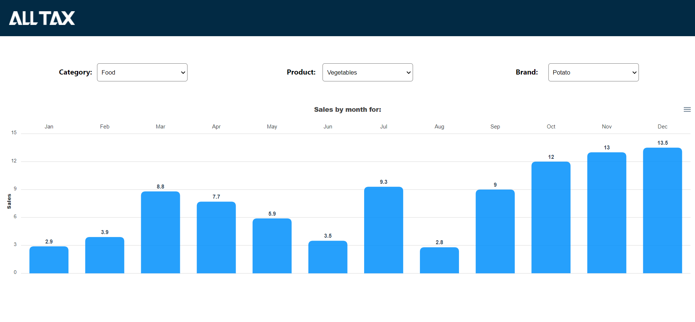
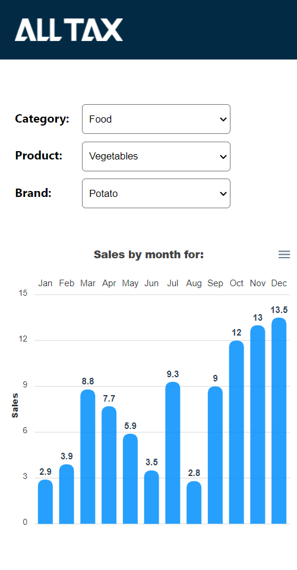

# Painel da All Tax

Este projeto tem como objetivo apresentar meus conhecimentos sobre desenvolvimento de interfaces. Para o projeto em questão eu utilizei React.JS (JS), HTML e CSS.

As bibliotecas auxiliares instaladas no projeto foram:

- [Apex Charts (Construção de Gráficos)](https://apexcharts.com/)

**Neste projeto evitei ao máximo utilizar bibliotecas ou frameworks para a construção da interface. Minha ideia é mostrar que é possível criar interfaces simples com as tecnologias propostas pelo problema. Um outro motivo também, é que quanto maior a quantidade de bibliotecas para resolver um problema, maiores as chances de construir um projeto pouco performático.**

# Iniciando o projeto

Para instalar os pacotes do projeto digite em seu terminal:

```
$ npm install
```

Para rodar o projeto digite em seu terminal:

```
$ npm run start
```

# Screenshots

Versão Desktop



Versão Mobile



# Agradecimentos

Desde já agradeço a oportunidade de estar participando deste processo seletivo. Tenho certeza que ele será de grande importância para o meu desenvolvimento profissional.